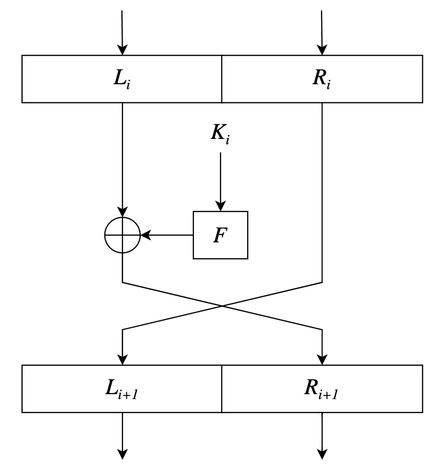
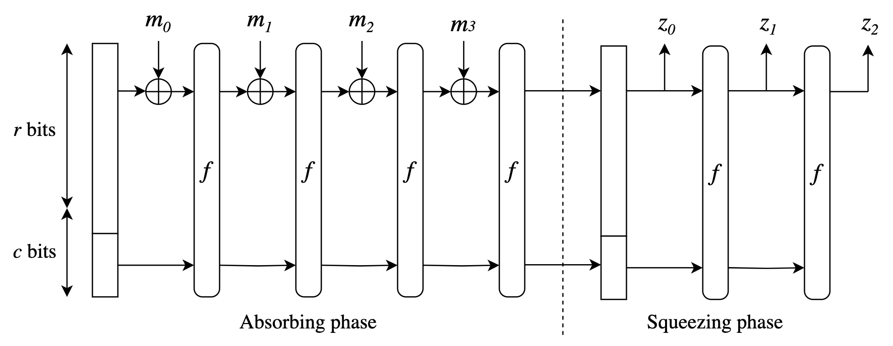

# MiMC Sponge Hasing Function

## Feistel Construction

Feistel is a cryptographic construction where we run the input through several rounds of the same operation to obscure the information.

<div align="center">

</div>

This image represent a single round which has two inputs and two outputs, the Left hand side ($L$) and the Right hand side ($R$):

- $R_i$ it's being fed into a function $F$ with the key $K_i$, and the output of this function it can be understanded as a $Mask$ for encryption and it's used to encrypt the left hand side input $L_i$.
- The $Mask$ and $L_i$ goes into a binary addition and this gives the encrypted output from the left hand side.
- Finally we exchange places of the encrypted output of left hand side and the right hand side for preparation for the next round.

Because each round of Feistel only encrypts half of the input, the left hand side, so to achieve the same level of encryption it's doubled the number of rounds than $MiMC$.

The $F$ function is $MiMC5$, so not only will add a key to this Feistel, will also add a $C_i$ which is the constant generated beforehand and feeded together into this $F$ function to construct the $Mask$:

$$
Mask = (R_i + K_i + C_i)^5
$$

## Sponge Construction

When we have a hashing or encryption routine, we can observe in the imag, that there is a repetitive function that's being repeatedly called,this is what we call an encryption routine.

<div align="center">

</div>

It's a way to adapt our code so it can take multiple inputs and turn out multiple outputs, this construction is so flexible that it can take an arbitrary number of inputs and turn out arbitrary length of outputs.

The initial structure in the image is the state of the encryption, with each round of the encryption routine the state will be updated and new information is fed to one portion of this input, this state is split into two parts:

- The `arm` ($r$ $bits$) that's actually actively taking inputs and turning out outputs.
- The `capacity` ($c$ $bits$) it is still fed into each encryption routine run but doesn't take or turn out information.

From the Feistel part, to achieve an effective diffusion ideally we want an independent source of randomness with respect to the part of the input that's being actively encoded so that it can provide a reference to determine the direction and target of the diffusion, this is why the capacity is being kept independent from taking inputs and turning out outputs, because you don't want it to get entangled and be dependent on the state of the input and the output.

In MiMC5Sponge $f$ is MiMC5 Feistel. As we run the routine, the encryption state will be updated, then we simple add input in the `Absorbing phase`, each input is being added to the $R$ portion fo the encryption state.

In the `Squeezing phase` comes the output, at the begining we have the encryption state and turn out the hashing output ($z_0$) from the $r$ $bits$, then we simply encrypt the state again and turn out some more outputs ($z_n$).

---

# About this example

This is a basic test implementation of MiMC5-Sponge hashing function.

## Running this example

### Requirements:

- [NodeJs](https://nodejs.org/)
- [Circom 2](https://docs.circom.io/getting-started/installation/)
- [Foundry](https://book.getfoundry.sh/getting-started/installation)

### Usage

Into the main directory execute:

```
$ bash run.sh
```

The foundry test should pass ok.

### Manual execution

#### Circom implementation

1. Generate a random input values into the `input.json` file.
2. Generate the webassembly circuit file:

```
$ circom MiMC5Sponge.circom --wasm
```

3. Generate the witness file:

```
$ node ./MiMC5Sponge_js/generate_witness.js ./MiMC5Sponge_js/MiMC5Sponge.wasm input.json witness.wtns
```

4. Export the witness file to a readable json file with `snarkjs`:

```
$ snarkjs wtns export json witness.wtns output.json
```

The `output.json` file will containe all the needed information to verify the hashing result:

```json
[
 "1",
 "6906751751132866857607779193285795505620303112443580868552435627972436601937",    // (Hash result)
 "456789641313213576432134676436514654",                                            // (k)
 "465496879413254687465132246579864132165",                                         // (ins[1])
 "486761234643215765132165743216576",                                               // (ins[2])
 "124526159513644676556066245536390529017852662381898855148275915819666365149",
 "18526273497268012656042589574535035380658746758970096024708814641553788213479",
 ...,
 ..,
 .
]
```

#### Solidity implementation

To execute this part locally will be necessary the previuos execution of the Circom implementation because we must need the output json file to verify the solution.

To verify the results we execute in a console:

```
$ forge test
```

The result of this execution should return something like:

```
Running 1 test for test/MiMC5SpongeTest.t.sol:MiMC5SopongeTest
[PASS] testVerifySolidityAndCircomResults() (gas: 105235)
Test result: ok. 1 passed; 0 failed; 0 skipped; finished in 100.09ms
Ran 1 test suites: 1 tests passed, 0 failed, 0 skipped (1 total tests)
```
